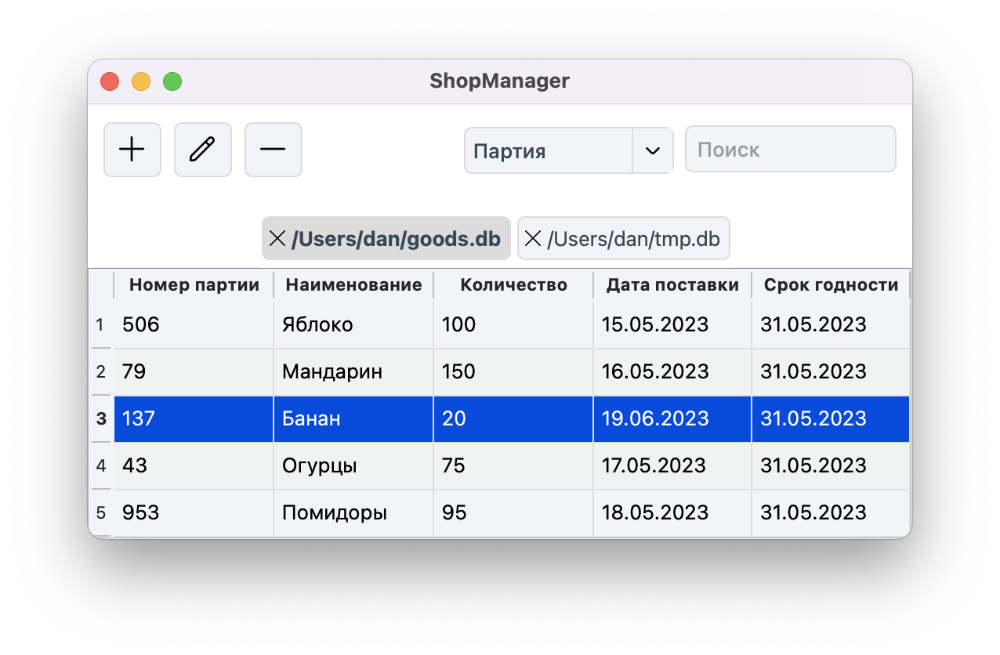

<div align="center">

# shop-manager

practical work at the department of cs6 of bmstu

</div>

## Contents

* [Task](#task)
* [Image](#image)
* [Installation](#installation)
    * [MacOS](#macos-installation)
    * [Linux](#linux-installation)

## Task <a name="task"></a>

Perform an object decomposition, develop interface forms, an interface state
diagram, class diagrams of the interface and subject areas, a diagram
of the sequence of actions of one of the implemented operations. Develop, test
and debug a program in Visual Studio or QT Creator.

The grocery store database contains information about the goods: batch number,
product name, quantity (pieces), delivery date, expiration date (in days).
The program must interactively generate a file, add and delete data, as well
as perceive each of the listed requests and give an answer to it.

1. Show all information about the goods received from the specified date.
1. Determine the names of goods whose expiration date expires today.
1. Determine the most perishable item (if there are several, show all).
1. Build a schedule of changes in the volume of receipts of a given product
by dates.

## Image <a name="image"></a>



## Installation <a name="installation"></a>

### MacOS <a name="macos-installation"></a>

1. Install `qt` library:

```sh
brew install qt
```

2. Build project:

```sh
git clone git@github.com:daronenko/shop-manager.git
cd shop-manager/build
qmake ../shop-manager.pro
make
```

3. Run application:

```sh
open shop-manager.app
```

### Linux <a name="linux-installation"></a>

1. Install `qt` library:

```sh
sudo apt update
sudo apt install qt5-qmake
```

2. Build project:

```sh
git clone git@github.com:daronenko/shop-manager.git
cd shop-manager/build
qmake ../shop-manager.pro
make
```

3. Run application:

```sh
./shop-manager
```

